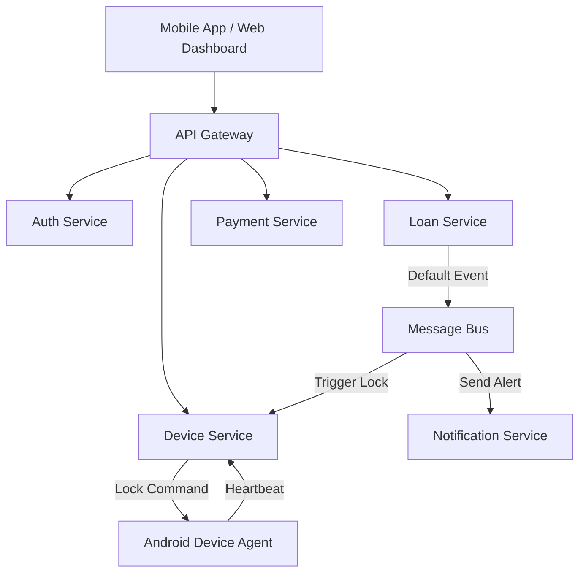

# VistaLock BNPL & Device Control Platform
## Full Product, Architecture & Security Documentation
**Version:** v1.0 (Android Devices – Default)

---

## 1. Executive Summary
VistaLock is a Buy-Now-Pay-Later (BNPL) and device-control platform that enables merchants to sell Android smartphones on installment while retaining secure digital control until repayment is complete. The platform combines lending, device enforcement, monitoring, and credit enablement in a scalable, enterprise-ready architecture.

**Core Value Proposition:**
- **Risk Reduction:** Digitally enforce repayment through device control.
- **Credit Enablement:** Help customers build credit history.
- **Merchant Empowerment:** Provide scalable tools for inventory and loan management.

---

## 2. Product Scope & User Roles

### 2.1 User Roles & Permissions Model
VistaLock operates a strict role-based access control (RBAC) system to ensure security, accountability, and merchant isolation.

#### **3.1 Customer (End User)**
*   **Who:** Individuals purchasing devices via BNPL.
*   **Core Functions:**
    *   Apply for BNPL financing.
    *   Accept device-control terms and consent.
    *   Receive and use financed Android device.
    *   View loan details and repayment schedule.
    *   Make installment payments.
    *   View outstanding balance.
    *   Receive payment reminders and lock warnings.
    *   Regain full device access upon repayment.
*   **Restrictions:**
    *   Cannot disable or uninstall device agent.
    *   Cannot modify device policies.
    *   Cannot access merchant or admin features.

#### **3.2 Merchant User (Staff Roles)**
Merchants may have multiple internal users with different permission levels.

**3.2.1 Merchant Owner / Admin**
*   **Who:** Business owner or primary account holder.
*   **Functions:**
    *   Merchant onboarding and KYC submission.
    *   Manage subscription plan and add-ons.
    *   Request additional device type support.
    *   Add and manage merchant staff users.
    *   View all devices, customers, and loans.
    *   Lock or unlock devices (policy-based).
    *   View financial settlements and reports.

**3.2.2 Merchant Manager**
*   **Functions:**
    *   Register and assign devices.
    *   Approve or reject BNPL applications.
    *   Monitor repayments and defaults.
    *   Trigger device locks (within policy).
    *   View analytics dashboards.
*   **Restrictions:**
    *   Cannot change subscription or pricing.
    *   Cannot request new device categories.

**3.2.3 Merchant Support / Agent**
*   **Functions:**
    *   View customer and device status.
    *   Assist customers with payment issues.
    *   View lock status and repayment history.
*   **Restrictions:**
    *   Cannot lock/unlock devices.
    *   Cannot approve loans.

#### **3.3 VistaLock Platform Admin**
*   **Who:** Internal VistaLock operations team.
*   **Functions:**
    *   Approve or suspend merchants.
    *   Configure global credit policies.
    *   Enable or disable device categories per merchant.
    *   Override device locks (exception handling).
    *   Monitor system health and abuse.
    *   Review audit logs.
    *   Manage integrations and payment gateways.

#### **3.4 Risk & Compliance Officer (VistaLock)**
*   **Functions:**
    *   Review high-risk merchants or customers.
    *   Configure fraud rules.
    *   Handle disputes and escalations.
    *   Ensure NDPR, KYC, and AML compliance.

#### **3.5 System & Automation Roles**
*   **Background Services:**
    *   Loan Default Detection Service.
    *   Lock/Unlock Orchestration Service.
    *   Notification Scheduler.
    *   Payment Reconciliation Service.
*   These operate without human access and are governed by strict service-level permissions.

#### **3.6 Role Enforcement Principles**
*   Least-privilege access.
*   Merchant-level data isolation.
*   Full audit logging.
*   Role-based UI rendering.
*   API-level permission checks.

---

### 2.2 Authentication & Login Process
VistaLock uses a unified authentication system with role-aware login flows.

#### **4.1 Core Authentication Principles**
*   Centralized Auth Service (single source of truth).
*   JWT-based access tokens with role-based session scopes.
*   Merchant-level tenancy isolation.

#### **4.2 Customer Login Flow (Mobile App)**
*   **Primary Methods:** Phone number + OTP (Optional PIN/Biometric).
*   **Security:** Device binding (account tied to financed device).

#### **4.3 Merchant Login Flow (Web Dashboard)**
*   **Primary Methods:** Email + password + Optional MFA.
*   **Process:** Credentials validated -> Merchant Status Verified -> Role (Owner/Manager/Support) Loaded -> Dashboard Rendered.

#### **4.4 Admin & Internal User Login Flow**
*   **Primary Methods:** Email + password + Mandatory MFA.
*   **Access:** Granted to Admin Console with elevated permissions.

#### **4.5 Device Agent Authentication**
*   **Method:** Mutual TLS with backend using device-issued certificate/key pair.
*   **Security:** Signed lock/unlock command verification.

### 2.2 Feature Parity & Improvements
| Feature | CredLock (Reference) | VistaLock |
| :--- | :--- | :--- |
| **BNPL Application** | ✅ | ✅ |
| **Device Lock on Default** | ✅ | ✅ (Enhanced "Device Deterrence") |
| **Wallet System** | ⚠️ Limited | ✅ Full Wallet (Virtual Balance) |
| **Credit Score Growth** | ✅ | ✅ |
| **Multiple Active Loans** | ❌ | ✅ (Policy based) |

### 2.3 SDK & Developer Access
VistaLock provides a robust Merchant SDK for programmable integration.

#### **5.1 API Key Authentication**
*   **Mechanism:** `x-api-key` header logic.
*   **Security:** Keys are generated via the `Auth Service`, hashed (bcrypt) in the database, and never shown again after creation.
*   **Scope:** API Keys allows server-to-server communication for:
    *   Registering Devices.
    *   Creating Loans.
    *   Processing Repayments.

#### **5.2 Device Limits & Subscription Enforcement**
*   **Starter Plan:** Max 20 Devices.
*   **Growth Plan:** Max 200 Devices.
*   **Enterprise:** Unlimited.
*   *Note:* Limits are strictly enforced by the `Device Service`. Attempts to register beyond the limit result in a `403 Forbidden` error.

#### **5.3 Loan Repayment & Auto-Unlock**
*   **Endpoint:** `POST /loans/:id/repay`
*   **Behavior:**
    1.  Records the payment in the Installment Ledger.
    2.  Checks total amount paid vs. total due.
    3.  **Auto-Unlock:** If fully paid, the backend automatically issues a secure `UNLOCK` command to the device agent.

---

## 3. Device Control Strategy (The "VistaLock Advantage")

### 3.1 Device Support Policy
* **Default Support (Available to All Merchants):**
    *   **✅ Android Smartphones:** Primary supported category.
* **On-Demand Paid Extensions (Restricted):**
    *   Tablets, POS Terminals, Laptops, IoT.
    *   *Availability Rule:* Enabled only upon merchant request, payment, and specialized agreement.

### 3.2 Android Device Agent – Technical Specifications
The Android Device Agent is a system-level enforcement application installed as a **Device Owner** (DPC).

#### **OS & Permission Requirements**
*   **Minimum OS:** Android 8.0 (API 26)+.
*   **Required Mode:** Device Owner (preferred) or Profile Owner.
*   **Critical Permissions:**
    *   `DEVICE_OWNER` / `MANAGE_DEVICE_POLICY`
    *   `DISABLE_KEYGUARD` / `LOCK_TASK_MODE`
    *   `PREVENT_FACTORY_RESET`
    *   `BLOCK_UNINSTALL`

#### **Lock UX & Behavior**
*   **Lock State:** Full-screen Kiosk mode. Blocks launcher, notifications, and recent apps.
*   **UI Elements:**
    *   "Device Temporarily Locked" message.
    *   Outstanding Balance & Due Date.
    *   "Pay Now" button & Emergency Call access.
*   **Offline Enforcement:** Grace periods and countdowns use a secure, server-synced monotonic clock that persists offline.

#### **Threat Model & Mitigation**
| Threat | Mitigation |
| :--- | :--- |
| **App Uninstall** | Device Owner mode prevents removal. |
| **Factory Reset** | Blocked via `addUserRestriction(DISALLOW_FACTORY_RESET)`. |
| **Safe Mode Bypass** | Agent persists across reboots and executes on boot. |
| **ADB/Debugging** | USB Debugging disabled via policy. |
| **Time Tampering** | Server-synced secure clock; ignores system time changes. |
| **Bootloader Unlock** | Detected via Key Attestation; triggers permanent lock. |

---

## 4. Merchant Packages & Commercial Model

| Package | Cost | Device Limit | Features |
| :--- | :--- | :--- | :--- |
| **Starter** | ₦ / Month | Up to 20 | Manual approvals, Basic Dashboard, Standard Lock. |
| **Growth** | ₦₦ / Month | Up to 200 | Bulk Upload, Auto-lock rules, Wallet settlement, API Access. |
| **Enterprise** | Custom | Unlimited | Custom device support, White-label, Dedicated SLA. |

---

## 5. System Architecture
**High-Level Microservices Architecture**

### 5.1 Service Breakdown
1.  **Auth Service:** Identity, RBAC, Tenant isolation.
2.  **Loan Service:** Loan lifecycle, interest calculation, installment tracking.
3.  **Device Service:** Device registry, IMEI binding, Command Queue (Lock/Unlock), Heartbeat processing.
4.  **Payment Service:** Wallet management, Gateway integration (Paystack/Flutterwave).
5.  **Notification Service:** Multi-channel alerts (SMS, Email, Push).

---

## 6. Device Control Flows

### 6.1 Lock Flow (Default)
1.  **Trigger:** `Loan Service` detects overdue payment > Grace Period.
2.  **Event:** `LOAN_DEFAULT` published to Event Bus.
3.  **Process:** `Device Service` consumes event, looks up Device ID.
4.  **Command:** `LOCK` command signed and queued.
5.  **Execution:** Agent receives command (Push/Poll) -> Enables Kiosk Mode.

### 6.2 Unlock Flow (Repayment)
1.  **Trigger:** `Payment Service` confirms transaction.
2.  **Event:** `PAYMENT_SUCCESS` published.
3.  **Process:** `Device Service` validates if loan is current.
4.  **Command:** `UNLOCK` command signed and sent.
5.  **Execution:** Agent verifies signature -> Removes Kiosk restriction.

---

## 7. Landing Page Structure (VistaLock)
**Goal:** Convert Merchants (B2B) and Trusted Customers.

### 7.1 Key Sections
1.  **Hero Section:**
    *   **Headline:** "Sell Devices on Installment. Get Paid. Stay in Control."
    *   **Sub-head:** "The complete BNPL & Device Control platform for Nigerian merchants."
    *   **CTAs:** "Get Started (Merchants)" / "Check Eligibility (Customers)".
2.  **Features Grid:**
    *   **BNPL + Device Lock:** "Secure your inventory with banking-grade device locking."
    *   **Credit Building:** "Help your customers build credit with every repayment."
    *   **Real-time Monitoring:** "Track every device and payment from one dashboard."
3.  **How It Works (Visual Flow):**
    *   Merchant Lists Device -> Customer Applies -> VistaLock Approves -> Device Locked -> Full Unlock on Completion.
4.  **Trust & Compliance:**
    *   NDPR Compliant, CBN-licensed payment partners, Secure Data.
5.  **Pricing (Transparent):**
    *   Starter / Growth / Enterprise cards.

---

## 8. Roadmap
*   **Phase 1 (MVP - 90 Days):** Android-only, Manual Merchant Dashboard, Core BNPL Engine.
*   **Phase 2:** Automated Credit Scoring, Cash Loans (Device as Collateral), Public API.
*   **Phase 3:** Enterprise Expansion (IoT/POS support), Insurance-backed loans.

---
*Generated for VistaLock Engineering & Product Team.*
